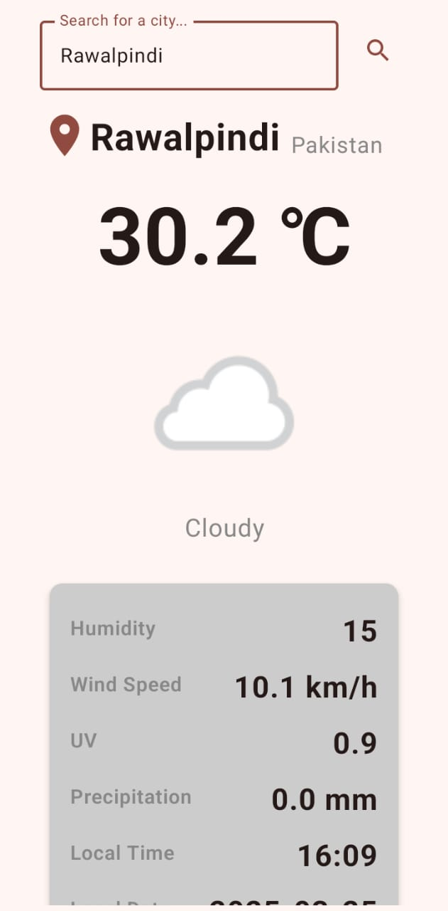

# 🌤️ Real-Time Weather App  

Get real-time weather updates with a clean, minimalist UI.  

<p align="center">
  
</p>

## Features  
- Current temperature, humidity, and weather conditions.  
- City search.  
- Built with **Jetpack Compose**, **Retrofit**.  

## Get an API Key:  
   - Sign up for free at [WeatherAPI](https://weatherapi.com).  
   - Copy your API key.

## Setup Instructions

1. **Clone the Repository:**
   ```bash
   git clone https://github.com/Hassan-Nisar-Ch/Realtime-Weather-App.git
   ```

2. **Open the Project in Android Studio**

3. **Add Your API Key:**
   Open the `local.properties` file in the project root and add the following line:
   ```properties
   WEATHER_API_KEY = your_api_key_here
   ```

4. **Build and Run the Project** on your device or emulator.
